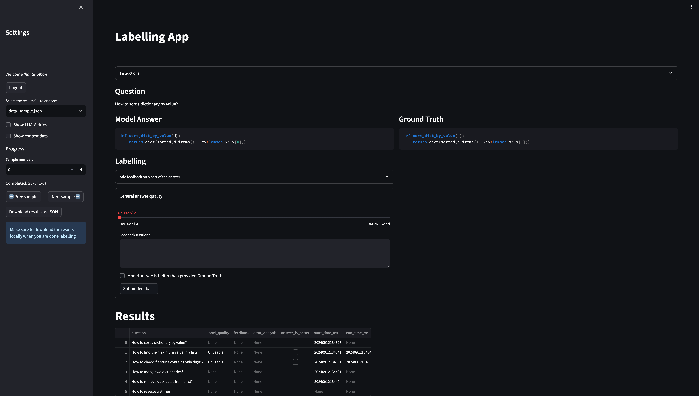
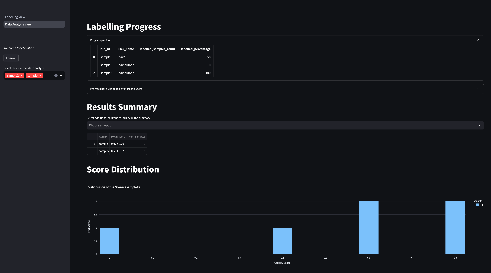

# Labelling App

This repository contains a web application developed with Streamlit for quick collection of feedback from Subject Matter Experts (SMEs) on machine learning-generated outputs. The application offers the following features:

- Data management via Azure Blob Storage
- Options to save progress and automatically reload results between different sessions
- Ability to record high-level feedback per sample, as well as detailed analysis of specific parts
- Ease of customization for specific use cases
- Detailed analysis and interactive visualizations for labelling experiments via the Data Analysis View.



## Setup

### Environment

1. Choose your preferred Python environment manager, such as Conda or venv.
2. Install project dependencies:

    ```bash
    pip install -r ./src/requirements.txt
    ```

3. Navigate to the `src/` folder and set up the `$PYTHONPATH`:

    ```bash
    cd src/
    source exports.sh
    ```

Alternatively, you can use the provided [Docker image](./Dockerfile):

```bash
docker build . -t labellingapp
```

(Optional) Install [pre-commit](https://pre-commit.com) hook to execute ruff before committing:

```bash
pre-commit install
```

### Azure Blob Connection

The web app relies on Azure Blob Storage to manage the labelling data and user credentials. Azure Blob Storage connection settings are configured via environment variables. All required key/values are described in the [`.env.template`](./src/.env.template) file.

### Upload Assets to the Blob Container

- Upload data for labelling to the blob container configured in the previous section. An example of data can be found in the provided [data sample](./src/assets/data_sample.json).
- Upload [config.yaml](/src/assets/config.yaml) to the blob container. `config.yaml` specifies [Streamlit-Authenticator](https://github.com/mkhorasani/Streamlit-Authenticator) settings for managing user sessions.

### Change Settings Based on Your Data

- [config.py](/src/config.py) sets the required column names for reading input data.
- [labelling_consts.py](/src/webpage/labelling_consts.py) sets the output column names and error categories.
- [labelling_instructions.md](/src/assets/labelling_instructions.md) provides a description of how SMEs should approach labelling.

### Extending with Custom Forms

The application supports extending the labelling interface with custom forms to collect specialized feedback:

- Create custom feedback forms for domain-specific evaluations
- Easily integrate new data collection components using the CustomFormHandler base class
- Add specialized metrics and insights to the Data Analysis View

For detailed implementation instructions, see the [Custom Forms Guide](/src/doc/custom_forms_guide.md).

## Data Analysis View

The Data Analysis View is a specialized dashboard for data scientists and project managers to monitor labelling progress and analyze results from the SME feedback collection process.



### Features

- **Progress Monitoring**: Track real-time labelling progress across users and experiments
- **Results Analytics**: Access comprehensive statistics on labelled data, including summary metrics and comparisons between different labelling runs
- **Visual Insights**: Interactive visualizations displaying score distributions and correlation analyses between ML metrics and SME evaluations
- **Quality Assessment**: Identify problematic examples through the "Top-10 Worst Examples" view, helping to pinpoint areas for model improvement

### Default Visualizations

The view provides several pre-configured visualization panels:

- Detailed labelling progress per user and per file
- Comprehensive summary statistics comparing metrics between different runs
- Distribution charts showing how SME scores are distributed across the dataset
- Correlation heatmaps between machine learning metrics and human evaluations
- Focused analysis of the lowest-scored examples to understand common failure patterns

### How to Enable

The Data Analysis View is role-restricted and only available to users with data scientist privileges:

1. In the `config.yaml` file, ensure users who need access have the appropriate role setting:

   ```yaml
   credentials:
     usernames:
       analyst_username:
         name: Analyst Name
         password: password_hash  # This should be a hashed password
         email: analyst@example.com
         data_scientist: true  # This enables Data Analysis View access
   ```

2. When a user with the appropriate role logs in, the "Data Analysis View" option will automatically appear in the navigation sidebar.

3. To customize available analytics, modify the `/src/webpage/data_analysis/ds_view.py` file.

## Security

- The web app itself does not implement any security checks or user access restrictions. It is recommended to restrict access to the service by placing it behind a network layer that implements user management, such as Azure App Service. More information can be found [here](https://learn.microsoft.com/en-us/entra/identity-platform/multi-service-web-app-authentication-app-service).

- There is an option to register and log in within the app, open to any users. This feature enables auto-saving of the results in the Azure Blob container. The user list can also be predefined by adjusting [config.yaml](/src/assets/config.yaml). See [Streamlit-Authenticator](https://github.com/mkhorasani/Streamlit-Authenticator) for available options.

- This application is not designed for managing highly confidential data. Additional security audits must be performed for such scenarios.

## Deployment

The web app can be packaged for deployment via the following Azure Pipeline: [.pipelines/webapp.yml](.pipelines/webapp.yml).

The pipeline updates the image in the Azure Container Registry (ACR). When Azure App Service is using the container registry, the deployment will trigger a webhook that updates the app based on the new image. Instructions for setup can be found [here](https://learn.microsoft.com/en-us/azure/app-service/tutorial-custom-container?tabs=azure-cli&pivots=container-linux).

## Contributing

This project welcomes contributions and suggestions.  Most contributions require you to agree to a
Contributor License Agreement (CLA) declaring that you have the right to, and actually do, grant us
the rights to use your contribution. For details, visit <https://cla.opensource.microsoft.com>.

When you submit a pull request, a CLA bot will automatically determine whether you need to provide
a CLA and decorate the PR appropriately (e.g., status check, comment). Simply follow the instructions
provided by the bot. You will only need to do this once across all repos using our CLA.

This project has adopted the [Microsoft Open Source Code of Conduct](https://opensource.microsoft.com/codeofconduct/).
For more information see the [Code of Conduct FAQ](https://opensource.microsoft.com/codeofconduct/faq/) or
contact [opencode@microsoft.com](mailto:opencode@microsoft.com) with any additional questions or comments.

## Trademarks

This project may contain trademarks or logos for projects, products, or services. Authorized use of Microsoft
trademarks or logos is subject to and must follow
[Microsoft's Trademark & Brand Guidelines](https://www.microsoft.com/en-us/legal/intellectualproperty/trademarks/usage/general).
Use of Microsoft trademarks or logos in modified versions of this project must not cause confusion or imply Microsoft sponsorship.
Any use of third-party trademarks or logos are subject to those third-party's policies.
